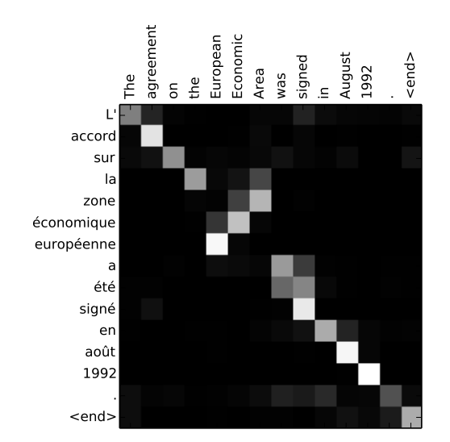
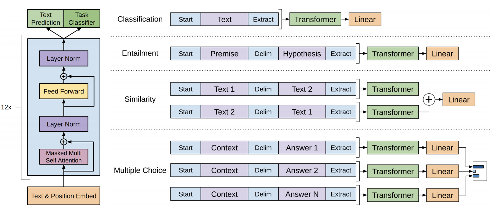
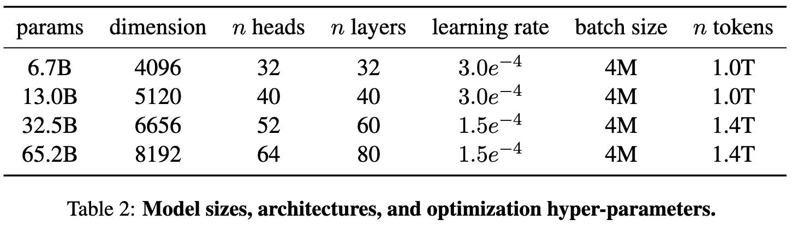

## Overview

LLaMA is a collection of foundation language models ranging from 7 billion to 65 billion parameters introduced by Meta, they trained their models on trillions of tokens, and it showed that it is possible to train state-of-the-art models using publicly available datasets exclusively, without resorting to proprietary and inaccessible datasets.

## Review on Transformer and GPT

Before we enter into the details of LLaMA, let's take a brief review of GPT and Transformer.

### Transformer

Transformer was developed in 2017 by researchers at Google and the University of Toronto, initially designed to do translation. But unlike recurrent neural networks, Transformers could be very efficiently parallelized. And that meant, with the right hardware, you could train some really big models.

This picture shows the Transformer architecture from the [original paper](https://arxiv.org/abs/1706.03762), and the iconic innovations can be decomposed into three parts:

1. Positional Encodings
2. Attention
3. Self-Attention

#### Positional Encoding

Let’s say we’re trying to translate text from English to Germany. The old way of doing translation is using neural networks like RNN, to understand word order by processing words sequentially. But this makes them hard to parallelize.

Positional encodings take all of the words into a sequence, and append each word with a number it’s order. So, you feed your network a sequence like:

*[("Hello", 1), ("from", 2), ("your", 3), ("old", 4),("friend", 5)]*

Conceptually, you can think of this as shifting the burden of understanding word order from the neural network structure to the data itself.

Initially, before the Transformer has been trained on any data, it cannot interpret these positional encodings. However, as the model sees more and more examples of sentences and their encodings, it learns how to use them effectively.

To simplify, the original authors used sine functions to generate positional encodings, not the simple integers 1, 2, 3, 4. Nonetheless, the point remains the same: storing word order as data rather than structure makes it easier to train your neural network.

#### Attention

Attention was introduced in the context of translation two years earlier, in 2015. To understand it, take this example sentence from the original paper:

*The agreement on the European Economic Area was signed in August 1992.*

Now imagine trying to translate that sentence into its French equivalent:

*L’accord sur la zone économique européenne a été signé en août 1992.*

One bad way to translate the sentence is to match each English word to its French equivalent one by one. This wouldn't work well for a few reasons. First, some words in the French translation are in a different order than their English counterparts. For example, "European Economic Area" in English is translated to "la zone économique européenne" in French. Second, French is a gendered language, so adjectives like "économique" and "européenne" must match the gender of the object they describe, in this case "la zone.”

Attention is a mechanism that allows a text model to “look at” every single word in the original sentence when making a decision about how to translate words in the output sentence. The following is a a visualization from the original attention paper:

This is a heat map that indicates where the model is "focusing" when it outputs each word in the French sentence. The model "focuses" heavily on the input words "European" and "Economic" when it outputs "européenne."

The model learns which words it should be "focusing" on at each time step by looking at thousands of examples of French and English sentences. It learns the interdependency of words and rules of grammar such as gender and plurality.

The attention mechanism was discovered in 2015 and has been a very useful tool for natural language processing. However, the 2017 Transformers paper innovated by completely ditching recurrent neural networks. That's why the paper is titled "Attention is all you need."

#### Self-Attention

The "vanilla" attention we discussed earlier aligns words across English and French sentences to aid translation. However, it's not always about translating words. Sometimes, we need a model that understands the underlying meaning and patterns in language. Such a model could be used for various language tasks.

Neural networks are powerful because they automatically build meaningful internal representations of the data they're trained on. For instance, a vision neural network may contain sets of neurons that recognize edges, shapes, eyes, and mouths. On the other hand, a text-trained model may learn parts of speech, grammar rules, and synonyms.

The better the internal representation of language learned by a neural network, the better it performs at any language task. Attention can help achieve this by focusing on the input text itself. For example, the word "server" in "can I have the check?" and "looks like I just crashed the server" has different meanings. Self-attention allows a neural network to understand the word "server" in the context of other words.

When processing "server" in the first sentence, the model may attend to "check" to disambiguate a human server from a machine one. In the second sentence, the model may attend to "crashed" to determine that "server" refers to a machine.

Self-attention can help neural networks disambiguate words, do part-of-speech tagging, entity resolution, learn semantic roles, and more. [Source](https://arxiv.org/abs/1905.05950).

### GPT

GPT stands for generative pre-trained transformer which is a type of large language model (LLM) neural network that can perform various natural language processing tasks such as question answering, text summarizing and even generating lines of code.

GPT is a Transformer-based architecture (the decoder part) and training procedure for natural language processing tasks. Training follows a two-stage procedure. First, a language modeling objective is used on the unlabeled data to learn the initial parameters of a neural network model. Subsequently, these parameters are adapted to a target task using the corresponding supervised objective.

GPT-1, a generative language model launched in 2018 by OpenAI, used a 12-layer decoder of the transformer architecture with a self-attention mechanism for training. One of its significant achievements was its ability to carry out zero-shot performance on various tasks, proving that generative language modeling can be exploited with an effective pretraining concept to generalize the model. GPT-2, developed by OpenAI in 2019, is a stronger language model with 1.5 billion parameters, making it 10 times larger than GPT-1. GPT-2 is trained upon a diverse dataset, making it powerful in terms of solving various language tasks related to translation, summarization, etc. by just using the raw text as input and taking few or no examples of training data. GPT-3 is a massive language prediction and generation model developed by OpenAI capable of generating long sequences of the original text. It is currently available with restricted access through an API on the cloud. Its significant benefit is its size; it contains about 175 billion parameters and is 100 times larger than GPT-2. Its other significant ability is to perform simple arithmetic problems, including writing code snippets and execute intelligent tasks. The purpose of GPT-3 was to make language processing more powerful and faster than its previous versions and without any special tuning.

|                    | GPT-1       | GPT-2       | GPT-3       |
|--------------------|-------------|-------------|-------------|
| Parameters         | 117 Million | 1.5 Billion | 175 Billion |
| Decoder Layers     | 12          | 48          | 96          |
| Context Token Size | 512         | 1024        | 2048        |
| Hidden Layer       | 768         | 1600        | 12288       |
| Batch Size         | 64          | 512         | 3.2M        |

## Why LLaMA

The objective of the scaling laws presented by Hoffmann et al. (2022) is to determine the optimal dataset and model sizes for a given training compute budget. However, this objective ignores the inference budget, which becomes critical when serving a language model at scale. In this context, the preferred model for a target level of performance is not the fastest to train, but the fastest at inference. Although it may be less expensive to train a large model to achieve a certain level of performance, a smaller one that is trained for a longer period may ultimately be less expensive at inference. For example, while Hoffmann et al. (2022) recommends training a 10B model on 200B tokens,  LLaMA's 7B model continues to improve even after 1T tokens.

The focus of this work is to train a series of language models that achieve the best possible performance at various inference budgets, by training on more tokens than what is typically used. The resulting models, called LLaMA, ranges from 7B to 65B parameters with competitive performance compared to the best existing LLMs. For instance, LLaMA-13B outperforms GPT-3 on most benchmarks, despite being 10× smaller.

## Architecture

LLaMA trains large transformers on a large quantity of textual data using a standard optimizer.The entire training dataset contains roughly 1.4T tokens after tokenization. For most of the training data, each token is used only once during training, with the exception of the Wikipedia and Books domains, over which we perform approximately two epochs.

| Dataset       | Sampling prop. | Epochs | Disk Size |
|---------------|----------------|--------|-----------|
| CommonCrawl   | 67.0%          | 1.1    | 3.3TB     |
| C4            | 15.0%          | 1.06   | 783GB     |
| GitHub        | 4.5%           | 0.64   | 328GB     |
| Wikipedia     | 4.5%           | 2.45   | 83GB      |
| Books         | 4.5%           | 2.23   | 85GB      |
| ArXiv         | 2.5%           | 1.06   | 92GB      |
| StackExchange | 2.0%           | 1.03   | 78GB      |

LLaMA model network is based on the transformer architecture (Vaswani et al., 2017). They utilize various improvements that were subsequently proposed and used in different models, such as PaLM. Here are the main differences with the original architecture, and the inspiration for these changes (in brackets):

1. Pre-normalization [GPT3]: To improve training stability, the input of each transformer sub-layer was normalized instead of the output. The RMSNorm normalizing function, introduced by Zhang and Sennrich (2019), was used.
2. SwiGLU activation function [PaLM]: The ReLU non-linearity was replaced with the SwiGLU activation function, introduced by Shazeer (2020), to improve performance.
3. Rotary Embeddings [GPTNeo]: The absolute positional embeddings were removed and replaced with rotary positional embeddings (RoPE), introduced by Su et al. (2021), at each layer of the network.

## Result

LLaMA-13B outperforms GPT-3 while being over 10 times smaller, and LLaMA-65B is competitive with Chinchilla-70B and PaLM-540B. This study shows that it is possible to achieve state-of-the-art performance by training solely on publicly available data, without relying on proprietary datasets. The release of these models to the research community is expected to speed up the development of large language models and aid efforts to enhance their robustness and address issues such as toxicity and bias. We also observed, as Chung et al. (2022), that finetuning these models on instructions leads to promising results, and we intend to investigate this further in future work. Additionally, we plan to release larger models trained on bigger pretraining corpora in the future, as we have seen a continuous improvement in performance with scaling.